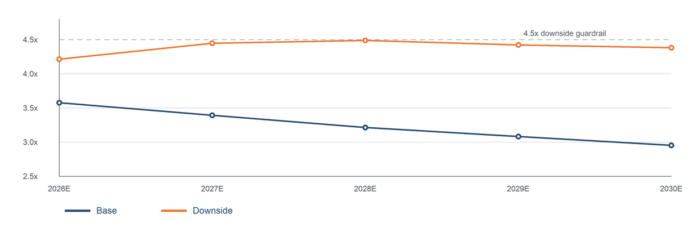
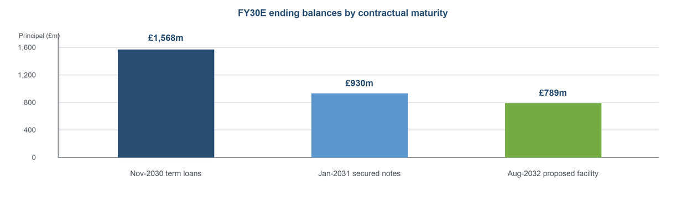

# Morrisons leveraged finance credit review

This independent portfolio project is a lender-side review of a hypothetical £900m senior secured refinancing for Morrisons. I rebuilt the post-2025 debt stack from public disclosures available by 17 June 2026 and tested debt service, liquidity and refinancing risk through FY30E.

The workbook is deliberately focused: it is a credit and debt-capacity model, not a sponsor returns model or a reconstruction of Morrisons' statutory accounts.

FY26E is a full-year pro forma case with post-refinancing opening balances, not an actual mid-year closing or stub forecast. RCF commitment fees are excluded; see [METHODOLOGY](METHODOLOGY.md) for fee and interest-timing sensitivities. The workbook is the analytical basis; report tables and PNGs are publication snapshots of the saved assumptions and must be refreshed after changes.

## Credit conclusion

**Approve with conditions.** The transaction moves the residual 2027 secured notes and £750m 2028 notes into a 2032 term-out, but it does not remove the need for a broader refinancing plan.

- Base-case net leverage declines from **3.58x in FY26E to 2.95x in FY30E**.
- Downside net leverage peaks at **4.49x in FY28E** and EBITDA / cash interest bottoms at **1.93x**.
- Downside RCF drawings reach **£461m**. The modelled **£839m FY30E liquidity** is available only if the RCF is extended or replaced before its August 2030 maturity.
- Without that replacement, the annual model indicates **£461m of replacement funding** to repay the drawn RCF while retaining the £300m minimum cash balance.
- Base-case term loans and secured notes of approximately **£2.50bn** mature between November 2030 and January 2031.

At 99 OID, the £900m facility produces £891m of cash proceeds against £895.8m of debt takeout. It uses £4.8m of cash for the shortfall and assumes £5m of other transaction fees. Illustrative cash falls from £350m immediately before closing to £340.2m after closing; the forecast starts from that post-closing balance.

The bars show **FY30E ending balances grouped by contractual maturity**. In particular, the proposed facility's FY30E balance is not a forecast of its August 2032 repayment amount.

## Repository contents

- [Model](model/Morrisons_Leveraged_Finance_Model.xlsx) — five-year base and downside forecasts, debt schedule, liquidity analysis, rate sensitivity, lender terms and integrity checks.
- [Credit report](report/Morrisons_Credit_Analysis_Report.pdf) — two-page lender memo.
- [Methodology](METHODOLOGY.md) — transaction sizing, calculation logic and model limitations.
- [Sources](SOURCES.md) — public inputs and their use.
- [Disclaimer](DISCLAIMER.md) — scope and intended use.

## How to review the model

Start with **Executive Summary**, compare **Base Case** and **Downside**, then review **Debt Capacity** and **Sources & Checks**. Blue font denotes assumptions, green font denotes public-information inputs and black font denotes formulas. Amounts are in £m unless stated otherwise.

Three conventions deserve attention:

1. Debt cash interest uses opening annual balances. This avoids circularity but does not fully capture interest on RCF drawings made during the forecast year, so downside coverage is directional.
2. FY30E RCF capacity is conditional on extension or replacement before August 2030. It is not treated as legally available beyond its disclosed maturity without that assumption.
3. RCF drawings are limited to the £1bn commitment. If a scenario needs more cash, the workbook shows the unfunded amount and fails its minimum-cash check.

Prepared by **Celine Kwak**, July 2026.
