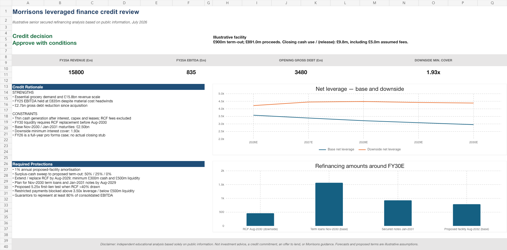
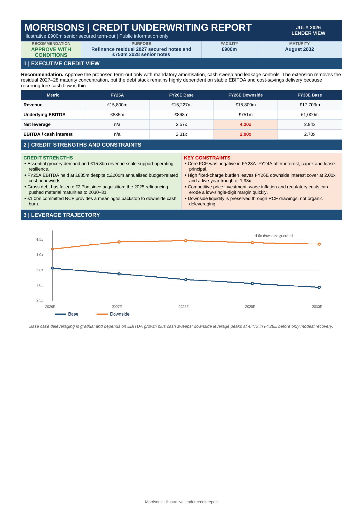
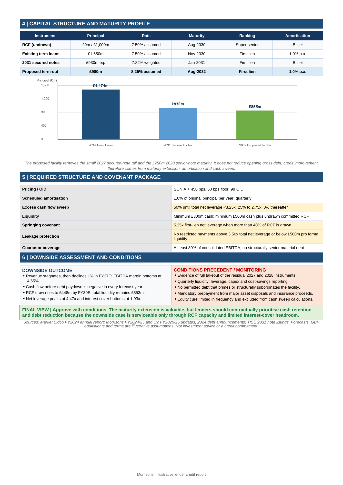

# Morrisons Leveraged Finance Credit Analysis

Independent lender-side underwriting exercise based solely on public information. I reconstructed Morrisons' post-2025 refinancing debt stack and assessed a hypothetical £900m senior secured term-out of the residual 2027 secured notes and £750m 2028 senior notes.

The purpose is to demonstrate how I approach debt capacity, downside resilience, liquidity and structural protection—not to reproduce a sponsor LBO model or forecast Morrisons' reported results.

## Credit conclusion

**Approve with conditions.** The transaction removes a concentrated 2027–28 maturity wall, but organic free cash flow is thin after cash interest, capital expenditure and lease payments.

- Base-case net leverage declines from **3.57x in FY26E to 2.94x in FY30E**.
- Downside net leverage peaks at **4.47x in FY28E**.
- Downside EBITDA / cash interest bottoms at **1.93x**.
- Downside RCF drawings reach **£448m**, leaving **£853m** of cash plus undrawn committed RCF at FY30E.
- The proposed protections include 1% annual amortisation, an excess-cash-flow sweep, minimum liquidity, restricted-payment controls and a springing leverage covenant.

## Credit report

[Open or download the searchable two-page PDF](https://raw.githubusercontent.com/onestepc10ser/morrisons-leveraged-finance-analysis/main/report/Morrisons_Credit_Analysis_Report.pdf)

### Page 1

### Page 2

## Repository contents

- [`model/Morrisons_Leveraged_Finance_Model.xlsx`](model/Morrisons_Leveraged_Finance_Model.xlsx) — formula-driven five-year base and downside model, debt schedule, liquidity analysis, debt capacity and checks.
- [Searchable two-page lender credit report](https://raw.githubusercontent.com/onestepc10ser/morrisons-leveraged-finance-analysis/main/report/Morrisons_Credit_Analysis_Report.pdf) — opens or downloads the PDF directly.
- [`METHODOLOGY.md`](METHODOLOGY.md) — transaction sizing, modelling logic and key limitations.
- [`SOURCES.md`](SOURCES.md) — public sources and the facts taken from them.
- [`DISCLAIMER.md`](DISCLAIMER.md) — scope and use restrictions.

## Three-minute review

1. Read the recommendation and credit metrics on the **Executive Summary** tab.
2. Compare the **Base Case** and **Downside** tabs, especially cash flow before debt paydown, RCF usage, net leverage and interest cover.
3. Review the **Debt Capacity** tab for the lender terms and covenant package.
4. Check the **Sources & Checks** tab to distinguish disclosed facts from independent assumptions.

## Model conventions

- Blue font: independent input or assumption.
- Green font: public-information input.
- Black font: formula.
- Monetary values: £m unless stated otherwise.
- Forecast years: FY26E–FY30E.

Prepared by **Celine Kwak**, July 2026.
